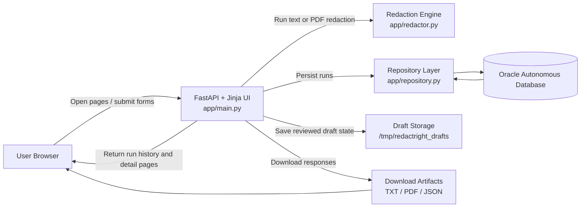
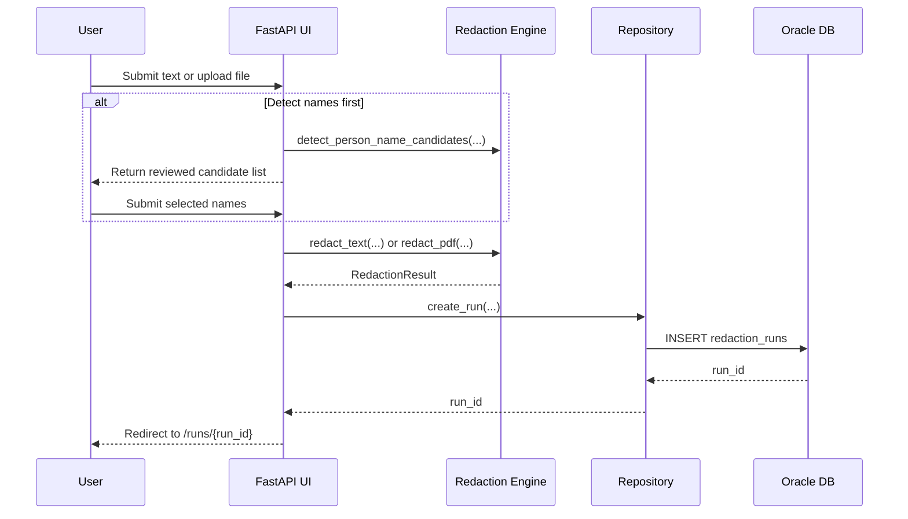

# Architecture

## Overview

RedactRight is a server-rendered FastAPI application with a thin UI layer, a redaction engine for text and PDFs, and an Oracle-backed persistence layer for run history and downloadable artifacts.

## System context



## Main components

### 1. Web layer

File: `app/main.py`

Responsibilities:

- Handles page rendering and form submission
- Parses uploaded files and pasted text
- Stores temporary draft state for reviewed name-detection flows
- Calls the text or PDF redaction engine
- Persists completed runs
- Returns downloadable text, PDF, and JSON report artifacts

Key routes:

- `/redact`
- `/runs`
- `/runs/{run_id}`
- `/runs/{run_id}/download`
- `/runs/{run_id}/download-pdf`
- `/runs/{run_id}/download-report`

### 2. Redaction engine

File: `app/redactor.py`

Responsibilities:

- Defines regex detectors for standard PII classes
- Accepts custom exact-match terms
- Applies person-name candidate heuristics
- Produces a normalized `RedactionResult`
- Handles both plain-text and PDF workflows

Design notes:

- Text redaction replaces matched spans with typed placeholders like `[EMAIL_REDACTED]`
- PDF redaction uses PyMuPDF word coordinates to place redaction annotations on the page
- PDF preview text is regenerated separately through the text redaction path for consistency

### 3. Persistence layer

Files: `app/repository.py`, `app/db.py`

Responsibilities:

- Initializes the Oracle client and connection pool
- Ensures the required schema columns are present
- Inserts saved redaction runs
- Fetches run history and detailed run payloads

Stored data includes:

- Original text
- Redacted text
- Detector options
- Match counts
- Findings metadata
- Original uploaded file blob
- Redacted file blob
- Creation timestamp

## Request flow

### End-to-end flow diagram



### Standard text redaction

```text
User submits text
  -> FastAPI parses detector options and custom terms
  -> redactor.redact_text(...)
  -> repository.create_run(...)
  -> redirect to /runs/{run_id}
```

### PDF redaction

```text
User uploads PDF
  -> FastAPI loads bytes and extracts preview text
  -> redactor.redact_pdf(...)
  -> repository.create_run(..., input_file_blob, redacted_file_blob)
  -> redirect to /runs/{run_id}
```

### Name-detection review loop

```text
User submits source for name detection
  -> detect_person_name_candidates(...)
  -> draft saved under /tmp/redactright_drafts
  -> user reviews suggested names
  -> second submission performs final redaction
```

## Data model

Primary table: `REDACTION_RUNS`

Important columns:

- `RUN_ID`: identity primary key
- `INPUT_TEXT`: original extracted text
- `REDACTED_TEXT`: redacted text preview
- `OPTIONS_JSON`: detector settings and source metadata
- `COUNTS_JSON`: redaction counts by detector type
- `FINDINGS_JSON`: detailed findings payload
- `INPUT_FILE_BLOB`: original uploaded file when applicable
- `REDACTED_FILE_BLOB`: generated redacted PDF when applicable
- `CREATED_AT`: run timestamp

## File and state handling

Temporary draft files are stored in `/tmp/redactright_drafts` so the app can preserve uploaded content between the name-detection step and the final redaction step.

This means:

- Drafts are machine-local and ephemeral
- A reboot or temp cleanup can invalidate an unfinished review flow
- The final saved run is durable once committed to Oracle

## Configuration

File: `app/config.py`

The application reads runtime configuration from environment variables:

- `DB_USER`
- `DB_PASSWORD`
- `DB_DSN`
- `DB_CONFIG_DIR`
- `DB_WALLET_LOCATION`
- `DB_WALLET_PASSWORD`
- `ORACLE_CLIENT_LIB_DIR`

## Security considerations

- The app handles sensitive data and currently has no authentication layer
- Uploaded inputs and generated artifacts are stored in the database
- Temporary drafts may contain sensitive text until cleanup
- The application is intended for hackathon/demo use and should not be treated as production-ready without access control, audit, retention, and encryption reviews

## Known tradeoffs

- Regex redaction is fast and explainable, but may miss edge cases
- Heuristic person-name detection improves usability, but may create false positives
- PDF redaction depends on extractable text geometry, so scanned-image PDFs need OCR support that does not exist yet
- The schema stores full text and artifacts for traceability, but increases data sensitivity and storage cost

## Future architecture improvements

- Add authentication and user ownership on runs
- Split service, repository, and UI concerns more explicitly
- Add OCR support for scanned PDFs
- Add background jobs for large-file processing
- Add object storage for large artifacts instead of storing every file in-table
